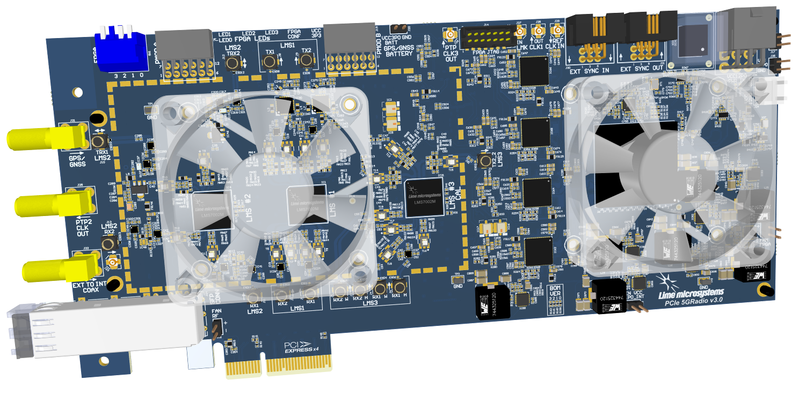

Introduction
============

PCIe 5GRadio is software defined radio board based on Lime LMS7002M Field Programmable Radio Frequency (FPRF) transceiver and Xilinx Artix-7 FPGA, through which apps can be programmed to support any type of wireless standard, e.g. UMTS, LTE, 5G, LoRa, GPS, WiFi, Zigbee, RFID, Digital Broadcasting, Radar and many more.

  
  Figure 1: PCIe 5GRadio v3.0 Board